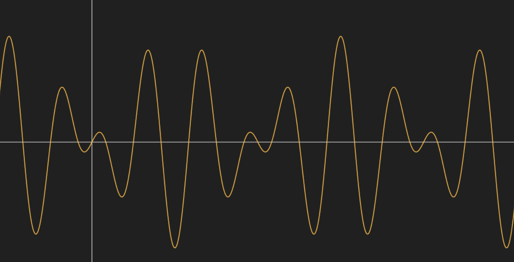
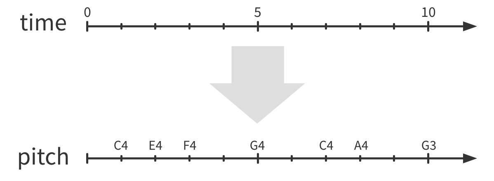
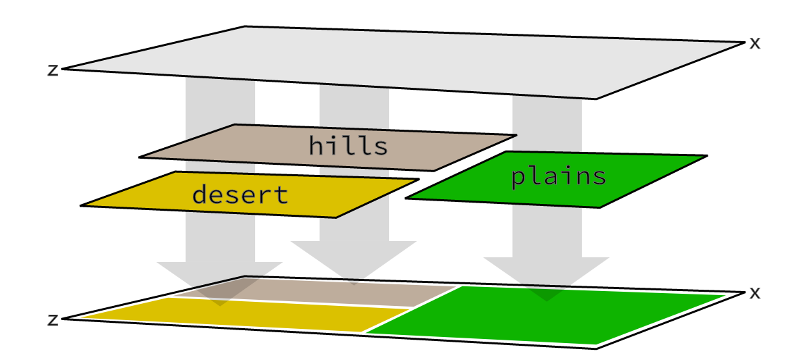

> # FOUR YEARS OF <br> JS PROC-GEN
<!-- .element: class="invert" -->


<br>

##### Andy Hall ・ <a href="https://twitter.com/fenomas" target="_blank">@fenomas</a>
##### JSConf Tokyo, Nov 2019


<!-- ###################################################### -->
<!-- ###################################################### -->
<!-- ###################################################### -->

---

<br><br>

> ## Proc-gen™ ?
<!-- .element: class="invert" -->

###### (aka Procedurally Generated Content, PCG, ...)

<br>

### ↓


----

<!-- .slide: data-background="./static/img/minecraft-classic.png" -->

<br>

> #### "contents made by an algorithm"
<!-- .element: class="invert" -->


----


#### Such as: <br><span class="smallest">(click and drag)</span>
<!-- .element: class="left" style="" -->

<iframe frameborder="0" width="800px" height="800px" data-src="./static/demos/projectron/"></iframe>
<!-- .element: class="right" -->


----

### About this talk:

<br>

 * High-level lessons for proc-gen
 * Mistakes I've made
 * Demos!  
   <span class="smaller">(source code links at the end)</span>


----

<br>

### About me:

<br>

* <a href="https://twitter.com/fenomas" target="_blank">@fenomas</a>
* currently: making a game / game engine
* formerly: tech evangelist at Adobe Japan
* よろしく etc.

<br>

### →


<!-- ###################################################### -->
<!-- ###################################################### -->
<!-- ###################################################### -->

---

#### Lesson 1:

<br>

> ### Dumb algorithms are Fine™
<!-- .element: class="invert" -->

<br>

### ↓


----

### Quiz question!

Guess what algorithm made this thing:

<iframe frameborder="0" width="450px" height="450px" data-src="./static/demos/projectron/small.html"></iframe>
<!-- .element: style="margin: 20px;" -->


----

### Answer:

<br>

>   1. Randomly change any vertex
>   2. Did rendered image get better?
>   3. If not, change it back
> 
> <br> (🔁 repeat a few million times)


----

<!-- .slide: data-background="./static/img/brain.png" -->
> ###### galaxy brain algorithm
<!-- .element: class="invert" -->

<br><br><br>

----


#### What it looks like in action:

> <a href="https://andyhall.github.io/glsl-projectron/" target="_blank">github:andyhall/glsl-projectron</a>


----

#### Proc-gen is about *creative* use
#### of *boring* algorithms

-------
<!-- .element style="margin: 80px;" -->

Fancy algos don't make the content interesting! 
Imagination and iteration are your key weapons. 


----

#### Aside: AI is mostly the opposite

<br>

With *ML* and *AI*, algorithms are everything -  
but you have little control over what comes out.

This talk won't cover ML/AI.


----

<br><br><br>

### So, how to get started?

<br><br>

### →


<!-- ###################################################### -->
<!-- ###################################################### -->
<!-- ###################################################### -->

---

#### Lesson 2:

<br>

> ### Think in Function Space™
<!-- .element: class="invert" -->

<br>

### ↓


----

#### In practice, using proc-gen <br> means replacing **content**...

<br>

#### ...with **functions** that <br> return content.
<!-- .element: class="fragment" data-fragment-index="1" -->


----

> `slime = `
<!-- .element: style="" -->

↓  
<!-- .element: class="fragment" data-fragment-index="1" -->

> `makeSlime = () => ` 
<!-- .element: style="width: 85%;" class="fragment" data-fragment-index="1" -->

↓
<!-- .element: class="fragment" data-fragment-index="2" -->

> `makeSlime => 　`
`, ` 
`, ` 
`...`
<!-- .element: style="width: 95%;" class="fragment" data-fragment-index="2" -->

----

#### <b>But:</b> any function can be
#### considered a *mapping*:

> 


----

```js
function makeSlime() {
   var color = 255 * Math.random()
   var size = 1 + Math.random()
  // ...
}
```
<!-- .element: style="width: 90%;" --> 


----

<!-- .slide: data-background="./static/img/function-space.png" -->


----

#### Proc-gen can be considered
#### a *function* mapping *inputs* onto 
#### an *n-D space* of content.

----

#### Calling the function
#### samples the space!

<br>

> `makeSlime() // `


----


> <a href="javascript:demo('voxels')">and now for a non-trivial example</a>
<!-- .element: style="width: 90%;" --> 


----

##### A procedural world is a bigger task,
##### but still just a *mapping*:

```js
function voxel(x, y, z) {

   // ...

}
```
<!-- .element: style="margin-top: 80px; width: 80%;" --> 


----


<br><br><br>

### Next: more complexity!

<br><br>

### →


<!-- ###################################################### -->
<!-- ###################################################### -->
<!-- ###################################################### -->

---

#### Lesson 3:

<br>

> ## Use Hidden Layers
<!-- .element: class="invert" -->

<br>

### ↓

----

#### Consider a new problem domain:

# **procedural music**


----

#### In function space:

"just" a 1D mapping  of *time* onto *pitch* 

<br>



----

> <a href="javascript:demo('music1')"><span style="font-size:200%">music demo!</span></a>
<!-- .element: style="width: 70%;" --> 

----

#### But a simple mapping feels
#### repetitive and homogeneous


----

#### colloquially: the
## "thousand bowls <br> of oatmeal" 
#### problem

----

#### Solution: **chord progressions**

<br> 


----

### With chords:

> <a href="javascript:demo('music2')"></a>
<!-- .element: style="width: 70%;" --> 


----

### Or go further:


----

#### No<b></b>te: in <a href="javascript:demo('voxels')">procedural worlds</a> 
#### hidden layers make <em>"biomes"</em>




----

<br><br><br>

### Now to make it shine!

<br><br>

### →


<!-- ###################################################### -->
<!-- ###################################################### -->
<!-- ###################################################### -->

---

#### Lesson 4:

<br>

> ## Make a Playground™
<!-- .element: class="invert" -->

<br>

### ↓

----

### Great proc-gen comes from
### *iteration* and *trial and error*


----

#### A playground is a unit test
#### for your function mapping

<br>

<iframe frameborder="0" width="420px" height="150px" 
  data-src="./static/demos/fake-playground/"
  style="transform: scale(1.75); border: 3px solid #444;"></iframe>


----

<br>

#### Cursed but real example:

> #### <a href="./static/demos/synth" target="synth_demo">Image synthesis playground</a>
<!-- .element style="width: 90%;" -->

<br>

##### (warning: cursed)

<br>


----

#### Alternate approach:
### HMR / hot-reloading

<br>

> ### <a href="javascript:demo('music3')">(HMR for music)</a>
 
<br>


----

#### Hot take:

> **JS is uniquely good for proc-gen!**  
<!-- .element: style="width: 95%; font-size: 135%; margin: 50px auto;" -->

##### because front-end devs are so good
##### at whipping up playgrounds.
##### Use this power!

### →


<!-- ###################################################### -->
<!-- ###################################################### -->
<!-- ###################################################### -->

---

<br>

> #### Summary
<!-- .element: class="invert" -->

<br>

 * Dumb algorithms are Fine
 * Think in Function Space  
 * Use Hidden Layers  
 * Make a Playground  

<br>
<br>


----

<!-- posterity version -->

##### Demos and source:
#### <a href="http://aphall.com/TODO" target="_blank">aphall.com/TODO</a>


> ### Thank you!
<!-- .element: class="invert" style="margin: 80px 0;" -->


###### <br>Andy Hall ・ <a href="https://twitter.com/fenomas" target="_blank">@fenomas</a>
###### JSConf Tokyo, Nov 2019
